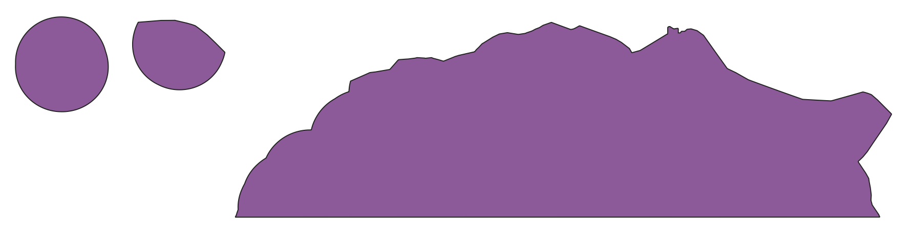
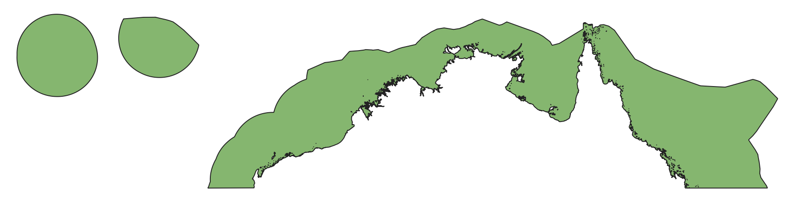
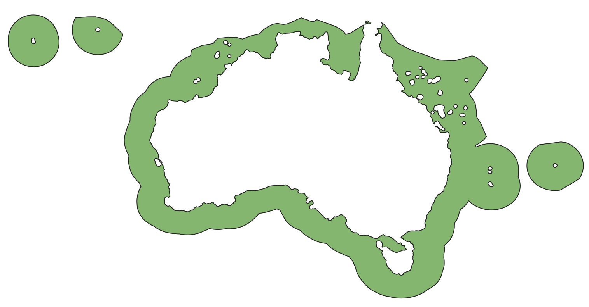
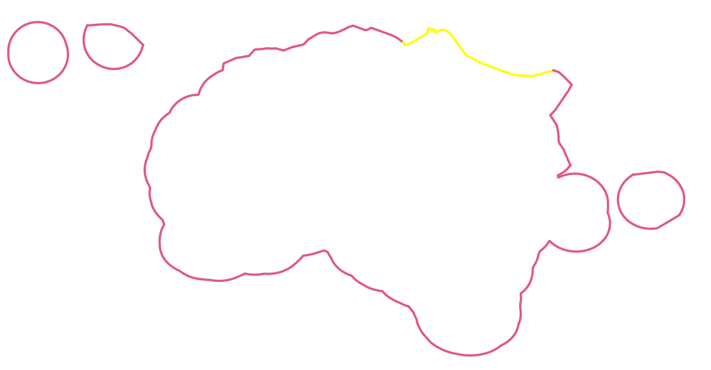
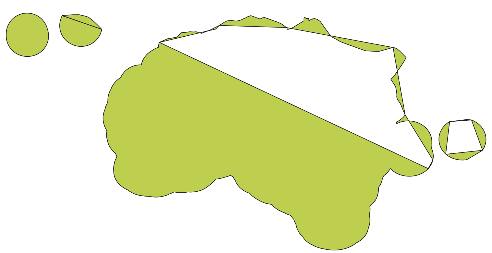
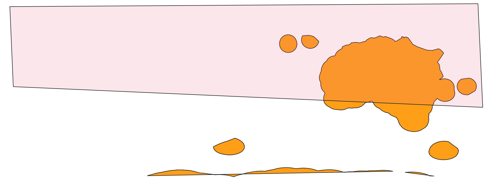
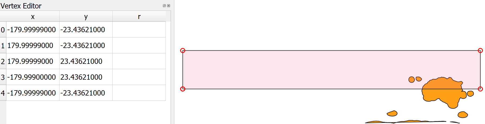
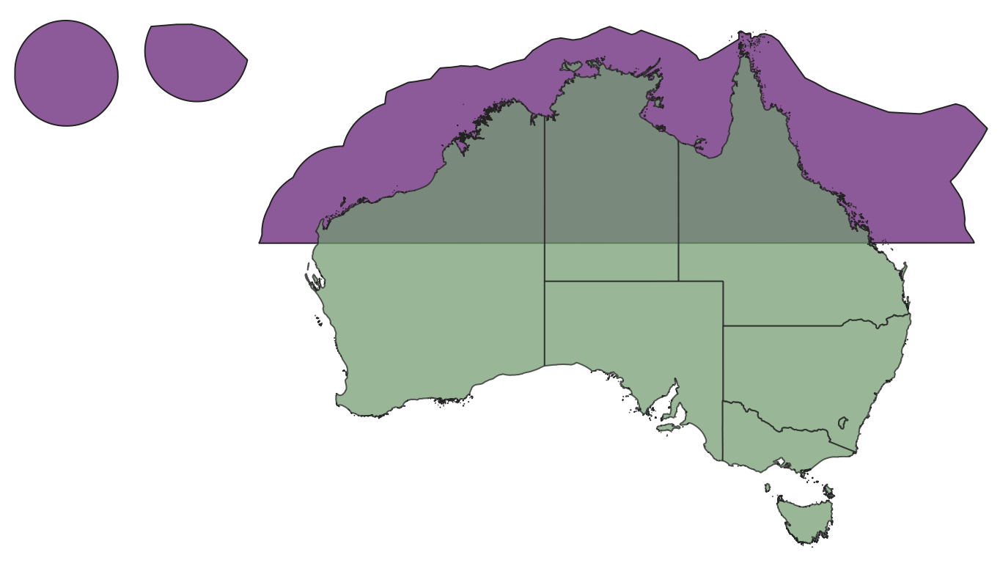

# Australian Exclusive Economic Zone AMB 2020 - Clipped to Tropics (AIMS, GA)
This dataset corresponds to the Australian Maritime Boundaries Exclusive Economic Zone clipped to the tropics, i.e. only retaining the boundary above the [Tropic of Capricorn](https://en.wikipedia.org/wiki/Tropic_of_Capricorn) at -23.43621 deg latitude.

## Download this dataset
This dataset is available for download from https://nextcloud.eatlas.org.au/apps/sharealias/a/AU_GA_AMB2020_EEZ-Limit_Tropics

## AU_GA_AMB2020_EEZ-Limit_No-land-clip_Tropics.shp


## AU_GA_AMB2020_EEZ-Limit_Tropics.shp


## Attribution
- **Title:** Australian Exclusive Economic Zone AMB 2020 - Clipped to Tropics (AIMS, GA)
- **Processing:** Eric Lawrey, Australian Institute of Marine Science
- **License:** Creative Commons Attribution 4.0 International Licence http://creativecommons.org/licenses/
- **Creation date:** 19 September 2023

## Tools
- Python - Downloading source data
- QGIS - For plotting the final data

## Source data

### EEZ and Territorial sea - AMB
Alcock, M.B., Taffs, N.J., Zhong, Q. 2020. Seas and Submerged Lands Act 1973 - Australian Maritime Boundaries 2020 - Geodatabase. Geoscience Australia, Canberra. https://pid.geoscience.gov.au/dataset/ga/144571

Creative Commons Attribution 4.0 International Licence http://creativecommons.org/licenses/

### GEODATA COAST 100K 2004
2004. GEODATA COAST 100K 2004. Geoscience Australia, Canberra. https://pid.geoscience.gov.au/dataset/ga/61395

Creative Commons Attribution 4.0 International Licence http://creativecommons.org/licenses/

## Reproducing this dataset
This section contains a set of instructions for reproducing this dataset. In order to get a EEZ boundary we need to base the data set on the EEZ Limits. If we use the EEZ Areas it doesn't cover the area from the 12 nautical mile limit to the coast.


Our general strategy is to use the outer line feature (EEZ Limits), convert it to a polygon, clip it to the tropics, then clip out the Australian Mainland. 

Note: This process does not convert Antartica into the correct shape polygon. This is fine since we are clipping to the tropics.

### Step 1: Download the Australian Maritime Boundaries and Australian Coast source data

1. Download the EEZ source data from GA. This can be done manually using a web browser by downloading the Shapefiles dataset from https://pid.geoscience.gov.au/dataset/ga/144571 and https://pid.geoscience.gov.au/dataset/ga/61395. Unpack the EEZ zip file then copy the Exclusive_Economic_Zone_AMB2020_Limits.\* files to the `original` folder. For the Australia land and islands copy australia/cstauscd_r.\*. This can also be achieved by running the `1_download-src-data.py` script file.

### Step 2: Open QGIS and load Limits data and convert to polygon
1. The EEZ limits is a set of line features. Each region is made up from multiple independent line segments. 
.
If we convert this directly to a polygon then the conversion will fail as the lines segments are not joined together.


To make this work we must first merge all the line segements for each region. We do this manually as there are no attributes in the data that would allow this to be scripted.

2. Using QGIS, load `Exclusive_Economic_Zone_AMB2020_Limits.shp`. Right click and Export / Save features As... as `temp\S2-2_EEZ_AMB2020_Limits_Merged.shp`.
3. Ensure the Digitizing Toolbar, Advanced Digitizing Toolbar and Selection Toolbar are visible. 
4. Select the `S2-2_EEZ_AMB2020_Limits_Merged` layer and enable editing using the `Toggle Editing` button.
5. Use the `Select Features` tool to select all the line segments around Australia mainland feature. Use the Shift key to accumulate multiple selections. Use the `Merge Selected Features` button to join all the features together. This will then popup a dialog asking what it should merge the values of the different segments. Just accept the default. We will be deleting all the attributes in the long run. Repeat this process for each of the regions. In some cases you will see a warning: 'Not enough features selected'. This just means that the region is already only a single line feature. Once complete use `Save Layer Edits` then untoggle the editing.
6. Use "Processing" > "Toolbox" > "Vector Geometry" > "Lines to polygons"
   - **Input layer:** S2-2_EEZ_AMB2020_Limits_Merged
   - **Polygons:** Create temporary layer
Right click on new layer and rename to: S2-6_EEZ_AMP2020_Limits_Polygon


### Step 3: Configure the New Shapefile Layer for the Tropics bounding box

1. In the "Layer" > "Create Layer" > "New Shapefile Layer" dialog, set the following configurations:
   - **File name:** `new-data/World_AIMS_Tropics-bounding-box.shp`
   - **Geometry type:** Select "Polygon".
   - **Coordinate Reference System:** Ensure it is set to "EPSG:4326".

2. Click "OK" to create the new shapefile layer.

### Step 5: Toggle Editing Mode

1. In the "Layers" panel, select your new shapefile layer.
2. Click the "Toggle Editing" button on the toolbar or go to "Layer" > "Toggle Editing" to enable editing mode.

### Step 6: Create an approximate Bounding Box

1. Click the "Add Polygon Feature" button on the toolbar.
2. On the map canvas, draw a rectangular polygon representing your bounding box. You don't have to be precise at this stage because you will enter the exact coordinates in the next step.



### Step 7: Enter Exact Coordinates

1. With the bounding box polygon selected, open the "Vertex Tool" (you'll find it in the toolbar).
2. Right click on the rough bounding box. You will see the vertex's coordinates displayed in a panel at the bottom of the QGIS window.
3. Enter the exact coordinates for each vertex of the bounding box according to your specified latitude and longitude boundaries. Typically, a bounding box will have four vertices, each representing a corner of the box.
4. After entering the exact coordinates for all vertices, click "Save Edits" on the toolbar to save your changes, then use "Toggle Editing" to disable further editing.

Note: I found odd behaviour when entering values too close to 180.00000, or if I have the north and south west most points have the same number of nines after the decimal place. For this reason one is -179.99999 and the other is -179.999.


### Step 9: Clip EEZ to Tropics Bounding box
1. Use "Vector" > "Geoprocessing Tools" > "Clip"
   - **Input layer:** S2-6_EEZ_AMP2020_Limits_Polygon
   - **Overlay layer:** World_AIMS_Tropics-bounding-box
   - **Clipped**: public/AU_GA_AMB2020_EEZ-Limit_No-land-clip_Tropics.shp

### Step 10: Load Australian Coastline and filter out ocean
1. Load the `src-data\AU_GA_Coast-100k_2004\cstauscd_r.shp` into QGIS
2. Right click on the Layer properties. Select "Source" > "Query Builder". Set the rule to:
```
"FEAT_CODE" != 'sea'
```


### Step 11: Dissolve all Australian features together
1. "Vector" > "Geoprocessing Tools" > "Dissolve"
   - **Input layer:** cstauscd_r
   - **Dissolved:** create temporary layer (This creates a layer called Dissolved)
   

### Step 11: Clip EEZ with land
1. Use "Vector" > "Geoprocessing Tools" > "Difference"
   - **Input layer:** AU_GA_AMB2020_EEZ-Limit_No-land-clip_Tropics
   - **Overlay layer:** Dissolved
   - **Clipped**: public/AU_GA_AMB2020_EEZ-Limit_Tropics.shp 

## Folder descriptions
- **new-data**: - This folder includes any data that was created as part of this dataset. This includes the shapefile to clip the EEZ to the tropics.
- **public**: - Final generate data that is shipped to the client. This typically includes a preview map.
- **src-data**: - Source data obtain from external public data sources. This data is typically downloaded automatically using a script. The downloaded data is not included in this repository to save on space (as it is assumed that it can be downloaded again if necessary).

## Paths
A copy of all the files associated with this dataset are stored in the eAltas repository at data\custodian\2020-2029-other\AU_GA_AMB2020_EEZ-Limit_Tropics

